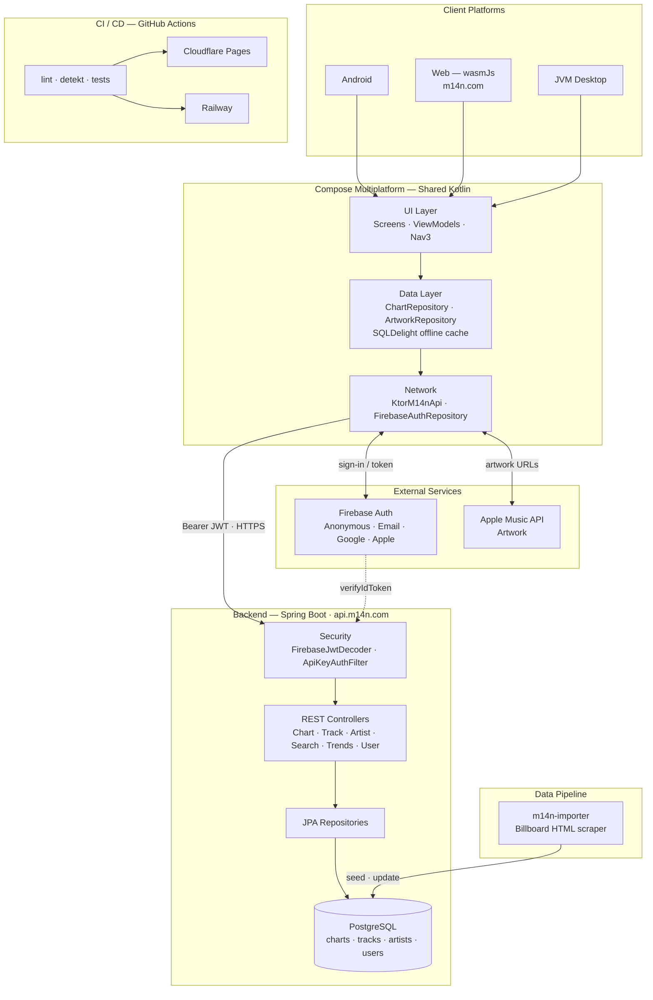

# M14N

Historical Billboard chart data — backend API, web app, and mobile apps.

- **Web**: https://m14n.com
- **API**: https://api.m14n.com ([Swagger](https://api.m14n.com))
- **iOS / Android**: coming to app stores

## Architecture



## Quick Start

### Prerequisites
- JDK 21, PostgreSQL 15+, Gradle 9.2.1

### Local Development

```bash
# 1. Setup database
createdb m14ndb
psql m14ndb < m14n-importer/src/main/resources/db/schema.sql

# 2. Import data
./gradlew :libraries:m14n-importer:import \
  --args="--data-path=/path/to/m14ndata/data --db-url=jdbc:postgresql://localhost:5432/m14ndb --db-user=YOUR_USER"

# 3. Run API
SPRING_PROFILES_ACTIVE=local ./gradlew :backend:bootRun
```

## License

MIT License — See LICENSE file for details.

## Contributing

**Pull requests are not accepted** due to the growth of agentic AIs.

For bugs, feature requests, or questions open an issue or contact via personal message.
All contributions will be reviewed and implemented by the maintainer.
