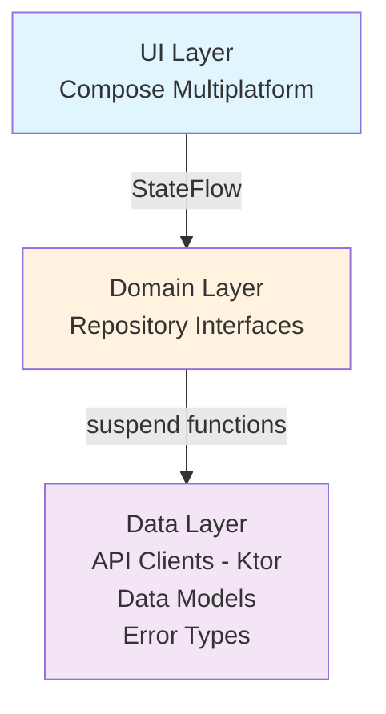

# Architecture

## Overview
Kotlin Multiplatform app using **MVVM** pattern with Repository abstraction.

**Platforms:** Android, Desktop (JVM), Web (WASM)

## Layer Structure



## MVVM Pattern

### ViewModel
- Holds UI state in `StateFlow`
- Handles user actions
- Coordinates with repositories
- Lives across config changes

### View (Composable)
- Observes state via `collectAsState()`
- Renders UI declaratively
- Emits user actions to ViewModel
- Stateless, pure functions

### Model
- Repository interfaces define operations
- Data classes are immutable (`@Serializable`)
- Network errors mapped to typed `ChartError`

## Dependency Injection (Koin)

**Module:** `appModule` in `di/AppModule.kt`

```kotlin
single { HttpClient { ... } }         // Ktor HTTP client
single<M14nApi> { KtorM14nApi }       // API implementation
singleOf(::ChartRepository)             // Repository
factoryOf(::ChartViewModel)             // ViewModel (new instance per injection)
```

**Platform Init:**
- Android: `M14nApplication.onCreate()`
- Desktop: `Main.kt` before window
- Web: `Main.kt` before viewport

## Data Flow

1. **User action** → ViewModel function
2. **ViewModel** → Repository suspend function
3. **Repository** → API network call (Ktor)
4. **API** → Parse JSON to data models
5. **Repository** → Return `Result<T>`
6. **ViewModel** → Map errors, update `StateFlow`
7. **UI** → Recompose with new state

## State Management

**Sealed interface pattern:**
```kotlin
sealed interface ChartUiState {
    data object Loading
    data class Success(...)
    data class Error(error: ChartError)
}
```

**Benefits:**
- Exhaustive `when` expressions
- Type-safe state
- No invalid states possible

## Error Handling

See `ChartError` sealed interface in `data/error/ChartError.kt`.

All exceptions mapped to typed errors via `ErrorMapper`:
- Network issues → `NetworkError`
- HTTP errors → `ServerError` with code
- Empty responses → `NoChartsAvailable`
- Fallback → `Unknown`

## API Documentation

**Source of truth:** `backend/src/main/resources/static/swagger.json`

**Access Swagger UI:**
- Local: `http://localhost:8080/swagger-ui.html` (when backend running)
- Production: `https://api.m14n.com/swagger-ui.html`

All API endpoints, request/response schemas, and examples are in the OpenAPI spec.

## Testing Strategy

- **Unit tests:** ViewModels with mock repositories
- **Integration tests:** Repository with mock API
- **UI tests:** Compose UI tests with fake ViewModels
